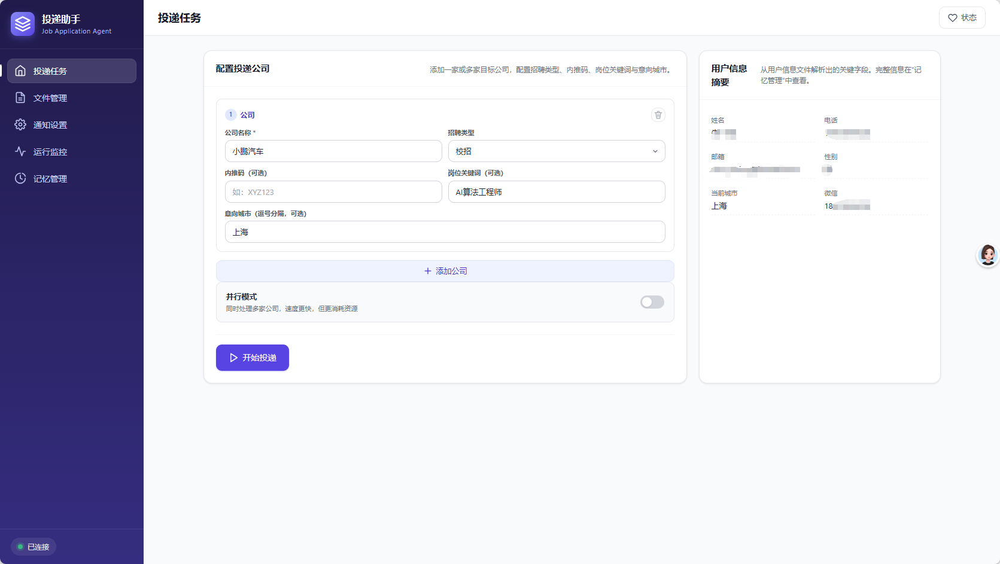
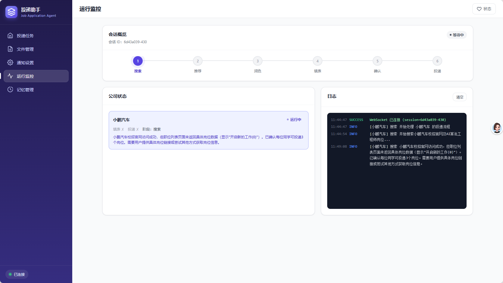
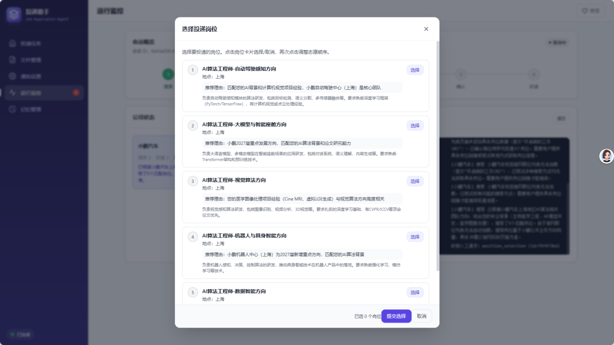
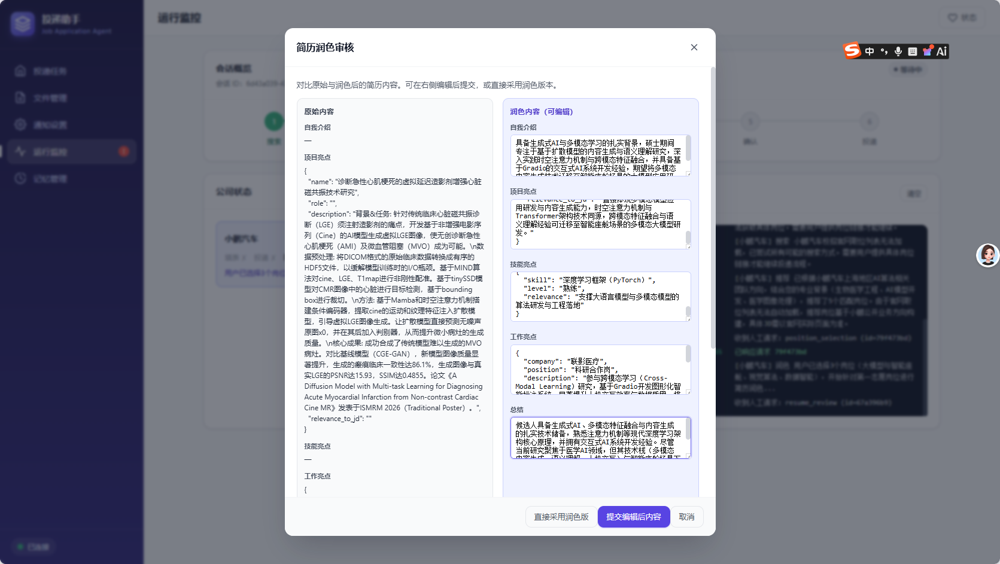
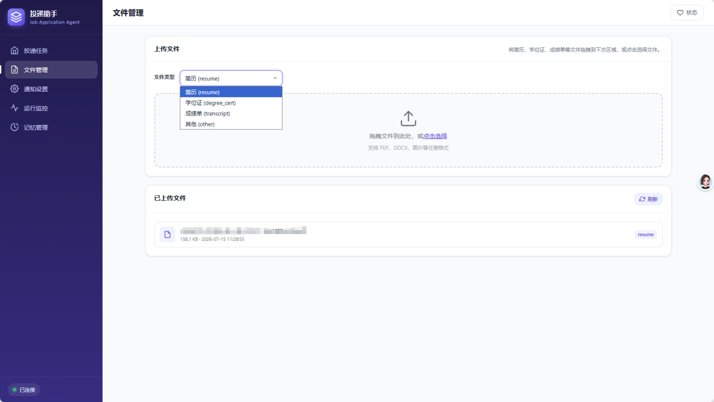
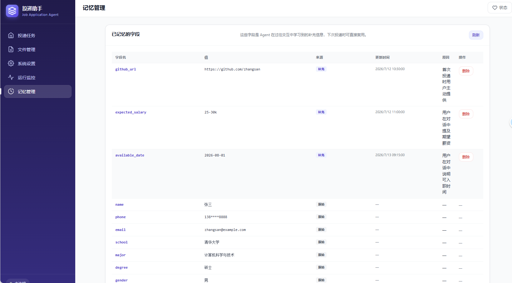
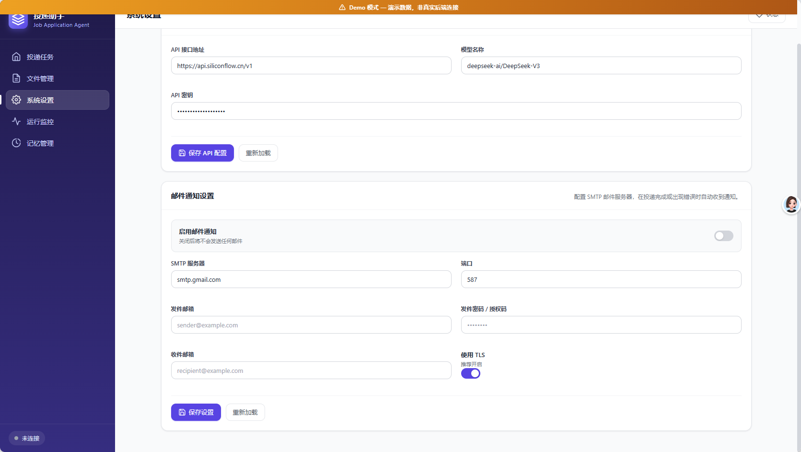

# 简历自动投递 Agent (LangChain/LangGraph 版)

基于 **LangChain** 和 **LangGraph** 框架的智能简历投递 Agent，能够根据用户提供的简历和个人信息文档，自动完成校招网申的批量投递工作。本仓库为项目的 LangChain/LangGraph 实现版本。使用WebUI与agent进行交互的实现效果，可以参考B站演示视频：【OfferBot（agent大赛演示视频）】 <https://www.bilibili.com/video/BV1763z6BEz7/?share_source=copy_web&vd_source=fb3f8e7af75b2c211cb415f68a7242b7>

## 功能特性

- 自动搜索和定位目标公司的招聘官网
- 根据用户条件筛选并推荐岗位
- 自动填写校招简历表单（支持文本框、下拉菜单、单选按钮、日历组件等）
- 支持简历附件上传
- 支持批量投递多家公司（并行或顺序模式）
- **智能记忆功能**：自动记录用户补充的个人信息，避免重复询问
- 支持多种通知方式（终端打印、系统弹窗、邮件通知）
- 基于 **deep agents** 框架的公司子 Agent 架构（一家公司一个子 Agent）
- 基于岗位 JD 的简历自适应润色，突出匹配内容提升竞争力
- 提供 **Web UI** 管理界面，支持浏览器可视化管理投递任务与实时监控

## 环境要求

- Python 3.12+
- Conda（推荐）或 pip

## 安装

### 1. 创建 Conda 环境

```bash
conda create -n job_agent_langchain python=3.12
conda activate job_agent_langchain
```

### 2. 安装依赖

```bash
pip install -r requirements.txt
playwright install chromium
```

依赖包括 `langchain`、`langgraph`、`langchain-openai`、`deepagents`、`playwright`、`python-dotenv`、`plyer`、`pydantic`、`fastapi`、`uvicorn`、`websockets`、`python-multipart` 等组件。

### 3. 配置 .env 文件

```bash
cp .env.example .env
```

编辑 `.env`，填写 `OPENAI_API_KEY`、`OPENAI_API_BASE`、`OPENAI_MODEL` 等配置项，可按需开启邮件通知与浏览器配置。

### 4. 准备个人信息文件

在 `data/` 目录下准备 `personal_information.txt` 文件，格式参考项目示例文件。

## 运行

```bash
PYTHONPATH=src python -m job_application_agent_langchain.main
```

## Web UI 使用

除命令行模式外，本项目提供基于 FastAPI + WebSocket 的 Web 管理界面，可通过浏览器可视化管理投递任务。

### 启动 Web UI

```bash
# 方式一：通过启动脚本（会先校验 .env 配置）
PYTHONPATH=src python -m job_application_agent_langchain.web.run

# 方式二：直接使用 uvicorn
uvicorn job_application_agent_langchain.web.app:app --host 0.0.0.0 --port 8000
```

启动后，在浏览器打开 <http://localhost:8000> 即可进入 Web UI。API 文档位于 <http://localhost:8000/docs>。

### 使用流程

配置公司投递任务 → 上传简历/学历证明/成绩单 → 配置邮件通知 → 启动投递 → 实时监控进度 → 人机交互（选岗/简历润色审核/补充缺失字段/投递确认） → 查看记忆

### 人机交互

投递过程中，Agent 会在关键节点通过 Web UI 弹出交互面板等待用户决策，共支持 4 种交互类型：

1. **岗位选择**：从搜索到的推荐岗位中选择要投递的岗位（含志愿顺序）
2. **简历润色审核**：展示润色前后对比（原版 vs 润色版），用户可编辑修改润色内容后确认
3. **缺失字段批量补充**：表单填写完成后一次性展示所有缺失的必填项，用户批量补充
4. **投递确认**：投递前弹出醒目警告，由用户决定是否由 AI 自动完成投递

### 记忆复用

用户补充的缺失字段会保存到记忆文件（`data/memory.json`），下次投递遇到相同字段时自动复用，无需重复询问。

### 基于 JD 的简历自适应润色

用户选定目标岗位后，系统获取该岗位的完整 JD（职位描述），使用 LLM 分析 JD 要求与用户简历内容的匹配度，生成针对性简历版本（突出匹配的项目经历、技能与关键词），经用户在 Web UI 审核编辑后填入表单。

## 运行测试

```bash
PYTHONPATH=src python -m pytest tests_langchain/ -v
```

## 项目结构

```
src/job_application_agent_langchain/
├── main.py                # 主入口（命令行模式）
├── config.py              # 配置管理
├── context.py             # 数据模型
├── memory.py              # 记忆存储模块
├── utils.py               # 工具函数
├── agent_events.py        # Agent 事件抽象与 CLI 实现
├── agents/
│   ├── orchestrator.py    # 投递流程编排器（并行/顺序）
│   ├── company_agent.py   # 公司子 Agent（deepagents harness）
│   ├── search.py          # 搜索官网与岗位工具
│   └── form.py            # 表单填写与投递工具
├── browser/
│   └── automation.py      # Playwright 浏览器自动化
├── resume_polish/
│   ├── polisher.py        # 简历润色主模块
│   ├── jd_analyzer.py     # JD 关键要求分析
│   ├── resume_matcher.py  # 简历内容匹配与提取
│   └── prompts.py         # 润色相关 Prompt
├── tools/
│   └── notify.py          # 通知工具
├── user_info/
│   └── parser.py          # 用户信息解析
└── web/
    ├── app.py             # FastAPI 应用主入口
    ├── routes.py          # REST API 路由
    ├── session_manager.py # 会话生命周期管理
    ├── emitter.py         # WebEventEmitter 事件桥接
    ├── schemas.py         # Pydantic 数据模型
    ├── file_storage.py    # 文件上传存储
    ├── settings_store.py  # 通知设置持久化
    ├── run.py             # Web 服务启动脚本
    └── static/            # 前端单页应用（HTML/CSS/JS）
```

## 记忆功能说明

当表单需要填写某个**必填字段**，但在用户的个人信息文档中找不到时：

1. Agent 跳过该字段继续填写其他可填字段，同时将缺失的必填项加入待询问列表
2. 表单填写完成后，批量询问用户所有缺失的必填字段
3. 用户补充后，自动记录到 `data/memory.json`
4. 下次遇到相同字段时，直接使用记忆中的值，不再询问

## 注意事项

- 首次运行前请确保已配置 `OPENAI_API_KEY`
- 建议先在少量公司上测试，确认流程正确后再批量投递
- 投递前会有确认提示，请仔细检查
- 部分网站可能有反爬虫机制，需要手动干预

## 实现效果

### 投递助手主页

根据用户输入的公司、岗位名称，自动到指定公司的校招官网检索相关岗位，以及当前招聘批次的投递规则。支持一次性投递多家公司，使用 multi-agent 协同机制，为每一家要投递的公司创建一个子 agent，节约模型上下文窗口。



图1 投递助手主页

### 实时任务进展

检索到岗位和当前招聘批次可以投递的岗位数量（假设某公司秋招最多只能同时投递 n 个岗位）后，根据用户简历中的项目经历，寻找匹配的 2\*n 个候选岗位，展示给用户，并附上推荐理由，让用户选择其中想投递的岗位进行投递。投递时会实时展示当前的任务进展。



图2 投递时会实时展示当前的任务进展

### 岗位选择

展示候选的岗位名称，并让用户进行选择。



图3 展示候选的岗位名称，并让用户进行选择

### 智能简历润色

用户选择想投档的岗位后，引导用户到网站登录页面完成账号登录/注册。之后，Agent 会自动根据每个岗位的岗位描述（JD），自动为用户的简历进行润色，有针对性地突出项目亮点，使简历更适配投递的岗位。完成润色的简历会交付用户审核，用户可以自行对润色结果进行修改。



图4 智能简历润色

### 附件自动上传

基于润色后的简历内容，AI Agent 自动在招聘官网完成简历表单的填写，以及相关文件的上传（如 PDF 版原始简历、学位证书、四六级成绩单、奖学金证明等）。



图5 用户上传成绩单等附件到 Agent 中，Agent 会自动上传这些附件

### 记忆管理

若在填写过程中，遇到必填项，但是用户简历中没有相关信息时，会主动弹窗询问用户该项信息的内容，并将结果保存在数据库中。这样后续投递其他公司时，如果遇到相同的字段就不需要再进行询问了。在"记忆管理"菜单中，可以对这些信息进行手动维护。



图6 记忆管理菜单。可以手动管理长期记忆

### 邮件通知设置

用户可以配置邮箱提醒功能。由于 agent 投递简历耗时较长，用户在使用产品时可能会最小化窗口并中途离开电脑。因此开发了邮箱提醒功能，当需要用户介入确认时（human-in-the-loop），如果用户超过 5 分钟没有回应，则会发送邮件到用户指定的邮箱，提醒用户回来。后续可能集成飞书消息提醒功能，让通知提醒更加及时。当投递工作完成时也会进行邮件提醒。



图7 邮件通知设置
