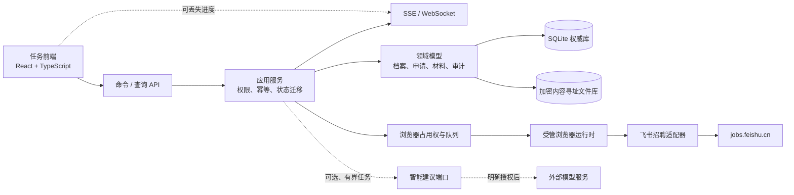
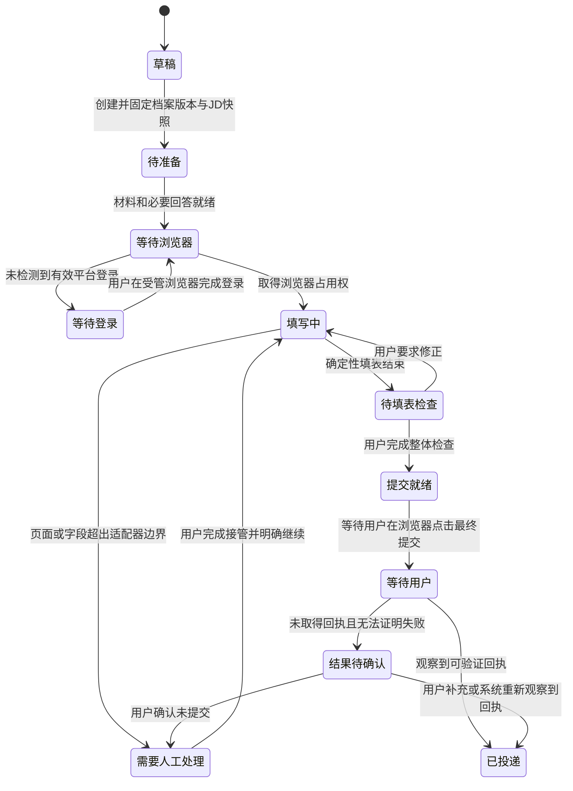
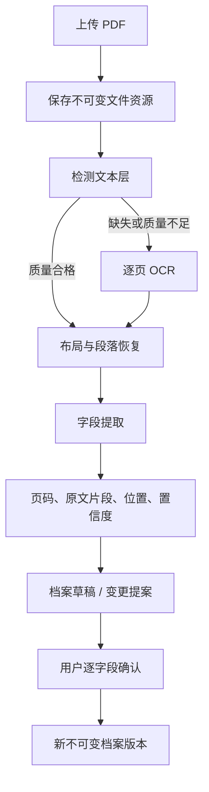

# 求职投递助手全面审查与重建方案

## 1. 结论

当前项目不是“局部稳定性不足”，而是业务事实、智能推理、浏览器副作用和聊天会话被混在同一条 Agent 链路中。继续在原链路增加提示词、超时和条件判断，只会把失败模式藏得更深。

重建方向已经确定：

- 产品定位为可靠优先的半自动投递助手，而非任意网站自主 Agent。
- 新建受控核心路径，渐进替换旧版 Agent 链路。
- 候选人档案、职位申请、申请材料、状态和审计记录成为独立持久领域对象。
- SQLite 和内容寻址文件资源库承载权威数据；聊天、WebSocket 和外部模型均不承载业务事实。
- v1 只正式支持飞书招聘；最终提交由求职者在受管浏览器中完成。
- 首个可用里程碑只交付档案版本管理和单职位基础申请闭环。

本文件是实施入口。具体产品与架构取舍以 [`CONTEXT.md`](../CONTEXT.md) 和 [`docs/adr/`](adr/) 中的决策记录为准。

## 2. 当前实现的主要问题

| 严重度 | 现状证据 | 直接后果 | 处置 |
| --- | --- | --- | --- |
| 阻断 | `user_info/parser.py:284-288` 仅使用 `pypdf` 文本提取 | 扫描件、复杂分栏、表格和布局信息容易丢失，且缺乏字段级证据 | 新建分层提取管线和质量门 |
| 阻断 | `web/routes.py:47-52` 总是选择“最新上传简历” | 已有申请会被后来上传的文件暗中改变，无法复现 | 申请固定引用不可变档案版本和文件资源 |
| 阻断 | `agents/company_agent.py:657` 将完整流程交给 `agent.ainvoke` | 导航、选择、填表、确认和异常恢复都受模型输出与对话上下文影响 | 用确定性状态机和平台适配器替代 |
| 阻断 | `agents/company_agent.py:339-342` 在用户确认后立即标记已投递 | 尚未点击提交或取得回执就产生错误业务事实 | 只有可验证回执才能进入已投递 |
| 阻断 | `browser/automation.py:51-69` 启动临时浏览器上下文 | 登录会话不能可靠跨任务或重启复用；复制 URL 到日常浏览器也不会共享 Cookie | 使用独立持久受管浏览器档案 |
| 高 | `web/session_manager.py:88` 只在进程内保存会话 | 服务重启即丢失当前流程和人工等待状态 | SQLite 持久状态机 |
| 高 | `web/emitter.py:72-86,150-183` 超时或取消时返回默认人工答案 | 断线可能被解释为拒绝、确认或默认成功 | 人工决定永久等待，不设业务默认值 |
| 高 | `agents/orchestrator.py:70-79` 可并行运行公司任务，同时 `browser/automation.py:28-34` 共享单一浏览器 | 多个申请竞争同一页面，状态和点击互相污染 | v1 单浏览器占用权与等待队列 |
| 高 | `memory.py:65-82`、`web/routes.py:255-300` 等位置直接读写明文 JSON | 数据结构分散、并发与迁移困难，敏感信息缺乏统一保护 | SQLite 权威库、加密文件资源和显式迁移 |
| 高 | `web/app.py:23-26` 允许任意来源 CORS | 本地敏感接口暴露面过大 | 仅回环监听、同源访问 |
| 中 | `document_parser/reader.py`、`agents/orchestrator.py` 和 UI 深度集成腾讯文档 | 登录、剪贴板、DOM 和来源解析引入大量非核心故障 | v1 完全删除腾讯文档能力 |
| 中 | 旧前端约 554 行 HTML、1867 行 JS、1411 行 CSS，状态集中在单体对象 | 档案版本、申请状态和断线恢复难以继续安全扩展 | React + TypeScript + Vite 重建任务前端 |

### 当前测试基线

2026-07-31 使用项目 `.venv` 运行 `tests_langchain`：

- 100 个测试通过。
- 1 个失败和 5 个错误均发生在 Windows 临时目录创建、清理或权限设置阶段。
- 1 个 Starlette/httpx 弃用警告。
- 尚无覆盖真实投递闭环、持久浏览器登录、重启恢复和回执判定的可靠端到端测试。

因此，现有单元测试可以作为旧行为防回退参考，但不能作为重建版本可用性的证明。

## 3. 目标架构



架构边界：

- 领域层不知道 FastAPI、Playwright、React、LangChain 或具体模型。
- 应用层负责命令幂等、预期版本检查、状态迁移、事务和审计事件。
- 基础设施层实现 SQLite、文件加密、操作系统凭据库和受管浏览器。
- 平台适配器只能在声明的页面和状态中执行受控操作。
- 模型只能产生建议或提案，不能改变业务状态或直接点击页面。

## 4. 核心领域对象

| 对象 | 关键约束 |
| --- | --- |
| 候选人档案 | 稳定身份；不等于某一份 PDF |
| 来源简历 | 不可变文件资源；保留摘要、媒体类型和来源 |
| 档案版本 | 不可变；编辑、接受变更提案都会产生新版本 |
| 档案变更提案 | 逐字段展示旧值、新值、来源证据和置信度；用户逐项接受 |
| 职位线索 | 尚未启动投递，不绑定档案和材料 |
| JD 快照 | 创建申请时固定，后续页面变化不静默覆盖 |
| 职位申请 | 固定引用档案版本、JD 快照和申请材料；拥有持久状态 |
| 申请材料 | 原始简历或申请专属定制材料；版本化且可追溯 |
| 申请回答 | 默认只属于一个申请；用户可明确提升为公司或平台复用回答 |
| 审计事件 | 追加写入；记录命令、状态变化、版本和证据 |
| 投递回执 | 平台确认页、申请编号或其他可验证成功证据 |
| 接管轨迹 | 人工接管的脱敏语义记录；只生成待审核的适配器改进提案 |

## 5. 申请状态机

状态名称在数据库中使用稳定代码，界面显示中文标签。禁止根据聊天文本推断状态。



通用规则：

- 所有人工决定都持久化为“等待用户”，断线和重启不自动代答。
- 最终提交永不自动重试。
- 只有能证明无副作用或能识别既有结果的步骤才能安全重试。
- 已投递申请继续固定原档案版本和材料版本。
- 切换档案版本后，申请必须重新生成拟填值并完成填表检查。

## 6. 数据与安全

### SQLite

建议的首批表：

- `candidate_profiles`
- `profile_versions`
- `profile_fields`
- `profile_change_proposals`
- `profile_change_items`
- `file_resources`
- `job_leads`
- `job_description_snapshots`
- `applications`
- `application_materials`
- `application_answers`
- `form_fill_runs`
- `form_field_values`
- `audit_events`
- `submission_receipts`
- `browser_tasks`

迁移使用显式、可回滚的 schema migration；不得在启动时用零散 `CREATE TABLE IF NOT EXISTS` 隐式升级生产数据。

### 文件资源

- 上传或生成文件以内容摘要作为稳定身份。
- 原始文件不可覆盖；同内容只保存一次。
- 数据库只保存资源元数据、引用关系和完整性摘要。
- OCR 中间文件在完成后立即删除。
- 截图和 DOM 快照默认保留 30 天，原始接管数据默认保留 90 天。

### 加密与凭据

- 敏感业务数据静态加密，主密钥由操作系统保护。
- 模型 API 密钥只保存在操作系统凭据库。
- 受管浏览器档案独立保存，但不进入普通备份包。
- 加密备份包由用户恢复口令保护，不包含 API 密钥、OS 主密钥和浏览器 Cookie。
- 日志、异常和遥测默认脱敏，不记录密码、验证码、完整 Cookie 或 Authorization 头。

## 7. PDF 与档案版本管线



质量门至少检查：

- 空白页和异常低文本量。
- 字符乱码率。
- 阅读顺序与分栏混排。
- 日期、电话、邮箱等关键字段的格式一致性。
- 字段是否具有可展示的来源证据。

提取结果是候选草稿，不是事实。任何模型补全都必须标为建议，不得伪造来源证据。

## 8. 命令与查询 API

首个里程碑的代表性端点：

### 查询

- `GET /api/v2/profiles`
- `GET /api/v2/profiles/{profile_id}/versions`
- `GET /api/v2/profile-versions/{version_id}`
- `GET /api/v2/change-proposals/{proposal_id}`
- `GET /api/v2/applications/{application_id}`
- `GET /api/v2/applications/{application_id}/audit-events`
- `GET /api/v2/browser/status`

### 命令

- `POST /api/v2/resumes`
- `POST /api/v2/profiles/{profile_id}/versions`
- `POST /api/v2/change-proposals/{proposal_id}/accept`
- `POST /api/v2/profile-versions/{version_id}/archive`
- `DELETE /api/v2/profile-versions/{version_id}`
- `POST /api/v2/applications`
- `POST /api/v2/applications/{application_id}/switch-profile-version`
- `POST /api/v2/applications/{application_id}/prepare-form`
- `POST /api/v2/applications/{application_id}/confirm-form-review`
- `POST /api/v2/applications/{application_id}/request-browser`
- `POST /api/v2/applications/{application_id}/confirm-manual-result`

所有变更命令：

- 使用调用方生成的 `Idempotency-Key`。
- 对可并发编辑对象携带 `expected_version`。
- 在一个数据库事务中更新状态并追加审计事件。
- 返回新的权威对象版本，而不是只返回“success”字符串。

## 9. 建议模块布局

```text
src/job_application_agent_langchain/
  domain/
    profiles/
    applications/
    materials/
    audit/
  application/
    commands/
    queries/
    services/
  infrastructure/
    database/
    file_store/
    credentials/
    encryption/
  resume_ingestion/
    text_layer/
    layout/
    ocr/
    quality/
  browser_runtime/
    owner.py
    managed_profile.py
    task_queue.py
  platform_adapters/
    base.py
    feishu/
  api_v2/
    routes/
    schemas/
    progress.py
frontend/
  src/
    profiles/
    applications/
    browser/
    audit/
    api/
tests_langchain/
  simulated_recruiting_site/
  e2e/
```

旧版 `agents/company_agent.py`、`agents/orchestrator.py`、`web/session_manager.py` 和 `memory.py` 在迁移期间冻结，不得被新模块反向依赖。

## 10. 实施顺序

每阶段都必须形成可演示的纵向结果，不进行长期不可运行的“大爆炸重写”。

### 阶段 0：保护现场和建立骨架

- 固定当前工作树清单，避免覆盖用户已有修改。
- 为旧测试排除残留的不可访问临时目录，记录可重复基线。
- 建立新模块、数据库迁移工具、配置边界和 React 构建链。
- 建立本地模拟招聘站点。

退出条件：旧入口仍可启动；新入口显示空的任务壳；后端和前端测试命令可重复运行。

### 阶段 1：档案版本纵向切片

- 内容寻址文件资源库。
- PDF 分层提取、字段证据与质量门。
- 档案草稿、人工确认和不可变版本。
- 上传更新 PDF、逐字段变更提案、切换、删除与归档。
- 对应任务前端页面和端到端测试。

退出条件：完全不调用外部模型，也能从两份 PDF 建立、比较和管理多个档案版本。

### 阶段 2：职位申请与持久状态

- 手动粘贴飞书职位 URL。
- 固定 JD 快照、档案版本和原始简历材料。
- 领域命令、幂等、预期版本、审计事件。
- 页面刷新和服务重启恢复。

退出条件：重启前后的申请状态、引用版本和审计序列一致。

### 阶段 3：受管浏览器与飞书适配器

- 持久 Playwright 浏览器档案和单一浏览器占用权。
- 明确提示用户必须在弹出的受管浏览器中登录。
- 飞书页面识别、字段映射、受控填表和人工接管边界。
- 不执行最终提交。

退出条件：模拟站点自动化验收通过；真实飞书人工冒烟到提交就绪。

### 阶段 4：提交结果与故障恢复

- 用户在受管浏览器点击最终提交。
- 回执观察、结果待确认、禁止自动重试。
- 重复命令、浏览器崩溃、登录过期、页面变化和服务重启测试。

退出条件：模拟站点完整端到端测试通过；经当次明确授权后，可用指定测试职位验证真实回执。

### 阶段 5：切换正式入口

- 新任务前端替换旧 UI。
- 执行旧数据迁移预览，但不静默导入。
- 删除腾讯文档入口和依赖。
- 在确认没有活动申请依赖旧链路后，删除旧 Agent 会话主链路和明文 JSON 业务存储。

退出条件：只有一个正式入口；基础申请路径不需要聊天或外部模型。

## 11. 首个可用里程碑的验收矩阵

| 场景 | 自动模拟站点 | 真实飞书人工 |
| --- | --- | --- |
| 文本型 PDF 建档 | 必须 | 抽查 |
| 扫描型 PDF OCR 建档 | 必须 | 抽查 |
| 更新 PDF 逐字段提案 | 必须 | 不适用 |
| 档案版本切换与删除规则 | 必须 | 不适用 |
| 申请固定版本与 JD 快照 | 必须 | 必须 |
| 登录状态跨服务重启保留 | 必须 | 必须 |
| 确定性填表与整体检查 | 必须 | 必须 |
| 重复命令不产生重复副作用 | 必须 | 不试探生产副作用 |
| 页面变化进入人工处理 | 必须 | 必须 |
| 最终提交无回执进入结果待确认 | 必须 | 仅明确测试职位 |
| 可验证回执进入已投递 | 必须 | 仅明确测试职位 |
| 无模型 API 完成基础路径 | 必须 | 必须 |

## 12. 切除与保留清单

### 首个里程碑开始即冻结

- `agents/company_agent.py`
- `agents/orchestrator.py`
- `web/session_manager.py`
- `memory.py`
- 旧聊天式前端
- `resume_polish` 主流程

### 新路径稳定后删除

- 腾讯文档 reader、登录、剪贴板和 DOM 提取代码。
- 腾讯文档 API、UI、配置和测试。
- 聊天消息驱动的投递续接与中断重跑。
- “最新上传文件”作为全局业务引用的逻辑。
- 明文 JSON 候选人信息、记忆和业务状态存储。
- 任意来源 CORS。
- 多公司共享同一页面的并行投递入口。

### 可以经过验证后复用

- 无副作用的字段归一化函数。
- 已有且稳定的飞书选择器或页面识别片段。
- PDF 文件类型与安全校验逻辑。
- JD 匹配和定制简历中的纯计算部分，作为后续可选能力。

## 13. 后续里程碑

只有首个可用里程碑通过双重验收后，才按以下顺序继续：

1. 旧数据迁移、加密备份与恢复界面。
2. 定制简历材料及模板 PDF。
3. 本地 CSV/XLSX 职位线索导入和飞书确定性职位列表。
4. 智能对话与有界智能建议。
5. 人工接管轨迹、适配器改进提案、审核发布和规则导出。
6. 评估第二个正式招聘平台。

## 14. 共享理解确认清单

开始实现前，需要对以下整体结论作一次最终确认：

- 不继续修补旧 Agent 主链路。
- 首个里程碑不追求自动找工作、批量投递或任意网站支持。
- 聊天与模型均不是核心依赖。
- 用户在受管浏览器中登录并点击最终提交。
- 档案、材料、申请和回执均版本化、持久化并可追溯。
- 新前端替换旧入口，不长期维护两套产品。
- 未通过模拟端到端和真实飞书冒烟前，不宣称可用。
- 实施过程中保留当前脏工作树中的用户修改，不做破坏性重置。
